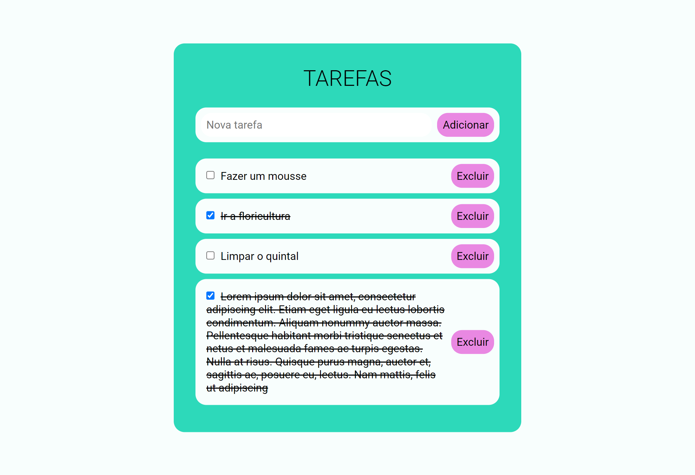
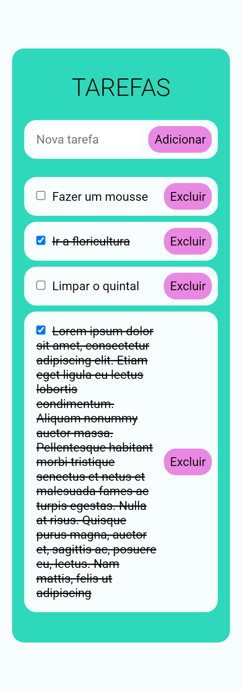

# Desafio Alliança - Dev FrontEnd

Essa é uma solução para o desafio de dev frontend proposto pela Alliança.

## Sumário

- [Desafio Alliança - Dev FrontEnd](#desafio-alliança---dev-frontend)
  - [Sumário](#sumário)
  - [Visão Geral](#visão-geral)
    - [O Desafio](#o-desafio)
    - [Integração com Context API](#integração-com-context-api)
    - [Capturas de tela](#capturas-de-tela)
    - [Links](#links)
  - [Meu processo](#meu-processo)
    - [Construído com](#construído-com)
    - [Recursos úteis](#recursos-úteis)
  - [Autor](#autor)

## Visão Geral

### O Desafio

- Crie um componente `TodoList` que exiba a lista de tarefas e inclua a funcionalidade para adicionar, marcar como concluída e excluir tarefas.
- Crie um componente `TodoForm` para adicionar novas tarefas à lista.
- Crie um componente `TodoItem` para exibir cada item da lista de tarefas.

### Integração com Context API

- Use a Context API para fornecer o estado da lista de tarefas a todos os componentes que precisam acessá-lo.
- Implemente funções para adicionar, marcar como concluída e excluir tarefas, e atualize o estado usando a Context API.


### Capturas de tela


_Lista de Tarefas - Versão desktop_

---

 
_Lista de Tarefas - Versão mobile_

---

### Links

- URL do Repositório: [https://github.com/Willwf/desafio-alianca-dev-frontend](https://github.com/Willwf/desafio-alianca-dev-frontend)
- URL do deploy na Vercel: [https://desafio-alianca-dev-frontend.vercel.app/](https://desafio-alianca-dev-frontend.vercel.app/)

## Meu processo

### Construído com

- HTML5 semântico
- Typescript
- Flexbox
- Mobile-first workflow
- [React](https://reactjs.org/) - Biblioteca JS
- CSS Modules
- [Vite.js](https://vitejs.dev/) - Bundler JS
- Context API (React)

> Antes de começar, você vai precisar ter instalado o Node.js no mínimo na versão 18.


1. Clone localmente este repositório.

2. Instale as dependências:

```sh
npm install
```

3. Execute a aplicação em modo de desenvolvimento:

```sh
npm run dev
```

### Recursos úteis

- [Realtime colors](https://www.realtimecolors.com/) - Muito útil para verificar cores com um bom contraste para serem implementadas na site.

## Autor

- Github - [William Firmino](https://github.com/Willwf)
- Twitter - [@Williamwf](https://www.twitter.com/Williamwf)
- LinkedIn - [William Firmino](https://www.linkedin.com/in/williamfirmino/)